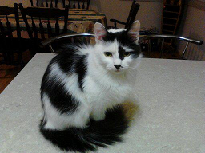

<!DOCTYPE html>
<html>
<head>
<meta name="viewport" content="width=device-width, initial-scale=1">

</head>
<body>

<h2>Responsive "Meet The Team" Section</h2>

Resize the browser window to see the effect.

 

  

    

      
      

        <h2>Jane Doe</h2>
        
CEO & Founder

        
Some text that describes me lorem ipsum ipsum lorem.

        
example@example.com

        
<button class="button">Contact</button>

      

    

  

  

    

      
      

        <h2>Mike Ross</h2>
        
Art Director

        
Some text that describes me lorem ipsum ipsum lorem.

        
example@example.com

        
<button class="button">Contact</button>

      

    

  

  

    

      
      

        <h2>John Doe</h2>
        
Designer

        
Some text that describes me lorem ipsum ipsum lorem.

        
example@example.com

        
<button class="button">Contact</button>

      

    

  

  

    

      
    

    

      <h2>Star</h2>
      
Glamorous Cat

    

  

</body>
</html>
